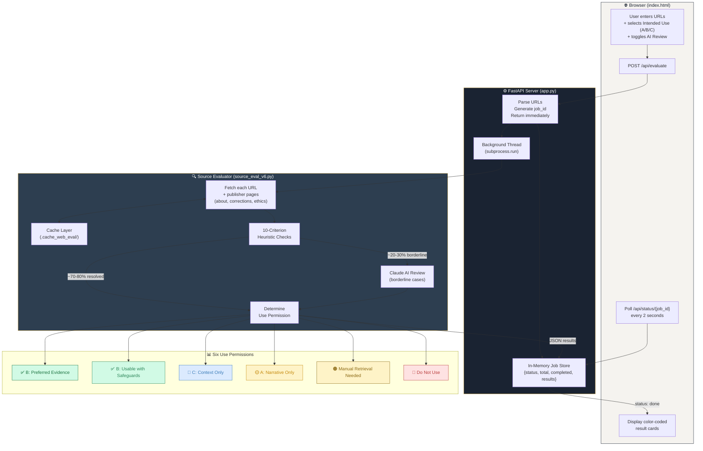
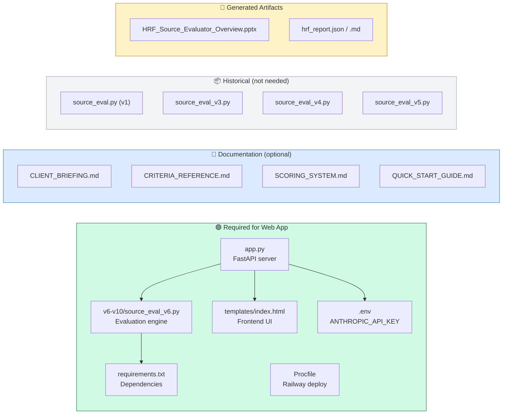

# Source Evaluator — Architecture

## Data Flow

```mermaid
flowchart TB
    subgraph Browser["🌐 Browser (index.html)"]
        UI["User enters URLs\n+ selects Intended Use (A/B/C)\n+ toggles AI Review"]
        Submit["POST /api/evaluate"]
        Poll["Poll /api/status/{job_id}\nevery 2 seconds"]
        Display["Display color-coded\nresult cards"]
    end

    subgraph Server["⚙️ FastAPI Server (app.py)"]
        API["Parse URLs\nGenerate job_id\nReturn immediately"]
        JobStore["In-Memory Job Store\n{status, total, completed, results}"]
        Thread["Background Thread\n(subprocess.run)"]
    end

    subgraph Evaluator["🔍 Source Evaluator (source_eval_v6.py)"]
        Fetch["Fetch each URL\n+ publisher pages\n(about, corrections, ethics)"]
        Cache["Cache Layer\n(.cache_web_eval/)"]
        Heuristics["10-Criterion\nHeuristic Checks"]
        LLM["Claude AI Review\n(borderline cases)"]
        Classify["Determine\nUse Permission"]
    end

    subgraph Outputs["📊 Six Use Permissions"]
        B1["✅ B: Preferred Evidence"]
        B2["✅ B: Usable with Safeguards"]
        C["🔵 C: Context Only"]
        A["🟡 A: Narrative Only"]
        M["🟤 Manual Retrieval Needed"]
        X["🔴 Do Not Use"]
    end

    UI --> Submit
    Submit --> API
    API --> JobStore
    API --> Thread
    Thread --> Fetch
    Fetch <--> Cache
    Fetch --> Heuristics

    Heuristics -->|"~70-80% resolved"| Classify
    Heuristics -->|"~20-30% borderline"| LLM
    LLM --> Classify

    Classify --> B1
    Classify --> B2
    Classify --> C
    Classify --> A
    Classify --> M
    Classify --> X

    Classify -->|"JSON results"| JobStore
    Poll --> JobStore
    JobStore -->|"status: done"| Display

    style Browser fill:#F5F3EF,stroke:#1A2332,color:#1A2332
    style Server fill:#1A2332,stroke:#D4A843,color:#FFFFFF
    style Evaluator fill:#2D3E50,stroke:#D4A843,color:#FFFFFF
    style B1 fill:#D1FAE5,stroke:#1B7340,color:#1B7340
    style B2 fill:#D1FAE5,stroke:#2D8659,color:#2D8659
    style C fill:#DBEAFE,stroke:#3B7CB8,color:#3B7CB8
    style A fill:#FEF3C7,stroke:#C4880B,color:#C4880B
    style M fill:#FEF3C7,stroke:#8B6914,color:#8B6914
    style X fill:#FEE2E2,stroke:#B83B3B,color:#B83B3B
```

## File Map

```mermaid
graph LR
    subgraph Required["🟢 Required for Web App"]
        app["app.py\nFastAPI server"]
        html["templates/index.html\nFrontend UI"]
        eval["v6-v10/source_eval_v6.py\nEvaluation engine"]
        req["requirements.txt\nDependencies"]
        env[".env\nANTHROPIC_API_KEY"]
        proc["Procfile\nRailway deploy"]
    end

    subgraph Docs["📄 Documentation (optional)"]
        brief["CLIENT_BRIEFING.md"]
        criteria["CRITERIA_REFERENCE.md"]
        scoring["SCORING_SYSTEM.md"]
        quick["QUICK_START_GUIDE.md"]
    end

    subgraph Archive["📦 Historical (not needed)"]
        v1["source_eval.py (v1)"]
        v3["source_eval_v3.py"]
        v4["source_eval_v4.py"]
        v5["source_eval_v5.py"]
    end

    subgraph Outputs["🎨 Generated Artifacts"]
        pptx["HRF_Source_Evaluator_Overview.pptx"]
        reports["hrf_report.json / .md"]
    end

    app --> eval
    app --> html
    app --> env
    eval --> req

    style Required fill:#D1FAE5,stroke:#1B7340
    style Docs fill:#DBEAFE,stroke:#3B7CB8
    style Archive fill:#F3F4F6,stroke:#9CA3AF
    style Outputs fill:#FEF3C7,stroke:#C4880B
```
