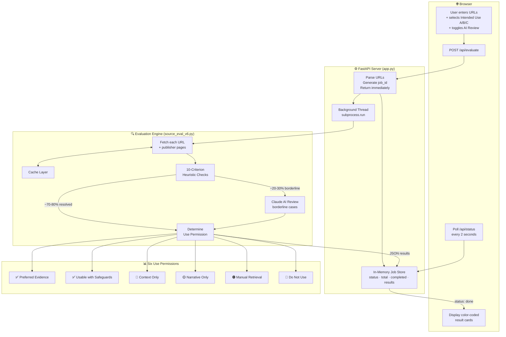

# Source Evaluator: Client Briefing

## Executive Summary

The Source Evaluator is an automated tool that assesses whether cited sources meet the evidentiary standards required for human rights documentation, legal advocacy, and policy work.

**Key Capability:** Evaluates sources against a 10-criterion framework and outputs actionable use-permission recommendations—not abstract credibility scores.

**Value Proposition:** Defensible, traceable determinations that integrate directly into research workflows, with full audit trails for every decision.

---

## What This Is

### The Problem
Human rights documentation requires rigorous source evaluation. Researchers must distinguish between sources suitable for factual claims, those valid only for attribution, and those that should be excluded entirely. Manual evaluation is time-consuming and inconsistent.

### The Solution
An automated system that answers a practical question: **"How can this source be used?"**

Rather than producing subjective credibility scores, the tool outputs one of six actionable use-permissions:

| Permission | Meaning | How to Use |
|------------|---------|------------|
| **B: Preferred evidence** | Strong, traceable, third-party source | Cite for factual claims with confidence |
| **B: Usable with safeguards** | Good evidence, needs corroboration | Cite with supporting sources |
| **C: Context-only** | Background/analysis material | Use for scene-setting, not factual support |
| **A: Narrative-only** | Self-interest or state source | Cite as "X claims..." with attribution |
| **Manual retrieval needed** | Access blocked (paywall, etc.) | Human must retrieve directly |
| **Do not use** | Satire, forums, or disqualifying issues | Exclude from documentation |

### Key Innovation
- **Access ≠ Credibility:** A paywalled New York Times article isn't unreliable—it just needs manual retrieval
- **Proportionality:** The same source can be valid for narrative (what they claim) but not factual claims (what actually happened)
- **Traceability:** Every determination links to specific evidence in the retrieved text

---

## What Was Built

### Technical Architecture
- Python-based evaluation engine (~1,800 lines)
- Web interface for browser-based evaluation
- Hybrid approach: fast heuristics + LLM augmentation for nuanced cases
- Caching layer for efficient re-evaluation
- Multiple output formats: JSON (audit trail), Markdown (human-readable), CSV (spreadsheet)

### System Architecture

### 10-Criterion Evaluation Framework

**Core Checks (1-7):**

| # | Criterion | What It Assesses |
|---|-----------|------------------|
| 1 | Intended Use | Purpose: narrative (A), factual (B), or context (C) |
| 2 | Relationship | Self-interest, state/official, or third-party |
| 3 | Completeness | How much content was successfully retrieved |
| 4 | Evidence Strength | Primary documents, attributed reporting, or assertions |
| 5 | Specificity | Verifiable details: who, what, when, where, how much |
| 6 | Corroboration | Whether claims appear in multiple sources |
| 7 | Severity Support | Additional checks for systematic abuse claims |

**Publisher Signals (8-10):**

| # | Signal | What It Looks For |
|---|--------|-------------------|
| 8 | Ownership Transparency | Does the publisher disclose who owns/funds them? |
| 9 | Corrections Behavior | Does the publisher acknowledge and fix errors? |
| 10 | Standards Transparency | Are editorial standards or methodology disclosed? |

### LLM Augmentation
Claude (Anthropic) reviews borderline cases for:
- **Source type assessment:** NGO vs. advocacy org vs. state media vs. news
- **Self-interest detection:** Distinguishes SOURCE (who published) from SUBJECT (what it's about)
- **Evidence strength review:** Upgrades/downgrades based on content analysis
- **Satire verification:** Confirms satirical content vs. journalism about satire

---

## Strengths: What It Does Well

| Strength | Why It Matters |
|----------|----------------|
| **Defensibility** | Every determination traces to specific evidence—no black-box scoring |
| **Proportionality** | Same source can be valid for narrative but not factual claims |
| **Severity-aware** | Systematic abuse claims trigger additional evidence requirements |
| **Source type nuance** | Correctly distinguishes NGOs reporting externally vs. advocacy orgs on own cause |
| **State media detection** | Automatically flags government-controlled outlets |
| **Scalability** | 100 sources in ~10 minutes with LLM augmentation |
| **Audit trail** | Full JSON export with evidence quotes for every determination |
| **Graceful degradation** | Works offline (heuristics-only) or with LLM enhancement |

### Ideal Use Cases
- Pre-screening citation lists for human rights reports
- Identifying sources requiring manual retrieval (paywalled, blocked)
- Flagging state media and self-interest sources before publication
- Documenting evidentiary basis for high-stakes claims
- Quality assurance for research teams

---

## Limitations: What It Cannot Do

| Limitation | Explanation |
|------------|-------------|
| **Access barriers** | Cannot bypass paywalls, bot-blocks, or login walls (~25% of sources) |
| **Language** | Optimized for English; limited non-English content analysis |
| **Real-time verification** | Cannot verify if claims are factually true—only if sourcing is adequate |
| **Novel source types** | May misclassify unusual or new publication types |
| **Context blindness** | Cannot assess relevance to specific research questions |
| **No fact-checking** | Evaluates source quality, not factual accuracy |

### What It Cannot Replace
- Human editorial judgment on relevance and significance
- Fact-checking and verification of specific claims
- Subject-matter expertise in interpreting sources
- Access to content behind authentication

---

## Source Type Handling

The tool applies different standards based on source type:

| Source Type | Expected Classification | Rationale |
|-------------|------------------------|-----------|
| **International NGOs** (Amnesty, HRW, Freedom House) | B: Preferred | Third-party watchdogs reporting on external actors |
| **Established News Media** (BBC, Reuters, NYT) | B: Preferred/Usable | Editorial standards, attribution practices |
| **Independent Think Tanks** (ISDP, Brookings) | B: Preferred | Research methodology, peer review |
| **Academic Sources** (journals, university research) | B: Preferred | Scholarly standards, citation practices |
| **State Media** (CGTN, Xinhua, RT, Global Times) | A: Narrative-only | Government-controlled, treat as official position |
| **Advocacy Organizations** (on own cause) | A: Narrative-only | Self-interest in claims about themselves |
| **Government Sources** (on themselves) | A: Narrative-only | Self-interest in own policies |
| **Wikipedia** | C: Context-only | Tertiary source—cite primary sources instead |
| **User-Generated Content** (Reddit, Quora) | Do not use | Unreliable, unverified |
| **Satire** (The Onion, Babylon Bee) | Do not use | Not factual content |

---

## Results from Test Run (100 Sources)

| Category | Count | Percentage |
|----------|-------|------------|
| B: Preferred evidence | 35 | 35% |
| Manual retrieval needed | 25 | 25% |
| B: Usable with safeguards | 17 | 17% |
| A: Narrative-only | 11 | 11% |
| C: Context-only | 7 | 7% |
| Do not use | 5 | 5% |

**Key Observations:**
- 52% of sources (35 + 17) are suitable for evidentiary use
- 25% require manual retrieval (paywalls, bot-blocks)
- 11% are state media or self-interest sources (narrative-only)
- 5% are satire or unreliable sources (excluded)

---

## Web Interface

The Source Evaluator is available as a browser-based application:

**Live URL:** [https://source-evaluator.vercel.app/](https://source-evaluator.vercel.app/)

### How to Use

**Step 1 — Enter Sources**

The interface offers three ways to input URLs:

| Input Method | How It Works |
|---|---|
| **Paste URLs** | Paste a list of URLs into the text box, one per line. Blank lines and non-URL lines are automatically ignored. |
| **Add One-by-One** | Type a single URL and click **+ Add**. Repeat for each source. URLs are listed below the input and can be removed individually. |
| **Upload File** | Drag and drop a `.txt` file (or click to browse). The file should contain one URL per line. The tool will parse and count the URLs automatically. |

**Step 2 — Configure Settings**

| Setting | Options | Description |
|---|---|---|
| **Intended Use** | B - Factual claims (strictest) | Use when sources will support factual claims in documentation |
| | A - Narrative / attribution | Use when sources will be cited as "X claims..." |
| | C - Context / background | Use when sources provide background or analysis |
| **AI Review** | On (default) / Off | When enabled, Claude AI reviews borderline cases for nuanced assessment. When disabled, the tool uses heuristics only (faster, no API cost). |

**Step 3 — Evaluate**

Click **Evaluate Sources**. The tool will:
1. Fetch each URL and extract its content
2. Analyze against the 10-criterion framework
3. Apply AI review for edge cases (if enabled)
4. Display results as color-coded cards

**Step 4 — Review Results**

Each source receives a color-coded badge:
- **Green** — Preferred Evidence or Usable with Safeguards (cite for factual claims)
- **Blue** — Context Only (use for background, not factual support)
- **Gold** — Narrative Only (cite as "X claims..." with attribution)
- **Brown** — Manual Retrieval Needed (paywall detected, human must access)
- **Red** — Do Not Use (satire, forums, unreliable)

Click any result card to expand and see:
- **Reason** — Why the tool assigned this permission
- **Relationship** — Whether the source has self-interest in the claims
- **Evidence Strength** — Strong, medium, or weak, with supporting quotes
- **Specificity** — Whether the source contains verifiable details (who, what, when, where)
- **Completeness** — How much content was successfully retrieved
- **Warnings** — Paywalls, bot-blocks, or other access issues

**Step 5 — Export**

Click **Export JSON** to download the full audit trail for all evaluated sources.

---

## Next Steps

1. **Try the web interface** at [https://source-evaluator.vercel.app/](https://source-evaluator.vercel.app/)
2. **Review QUICK_START_GUIDE.md** for command-line operational instructions
3. **Review VALIDATION_PROTOCOL.md** for accuracy tracking procedures
4. **Conduct initial calibration** with 50-100 sources against human expert judgment
5. **Establish feedback loop** to track researcher overrides and improve accuracy

---

*Developed for the Human Rights Foundation's source credibility standards.*
